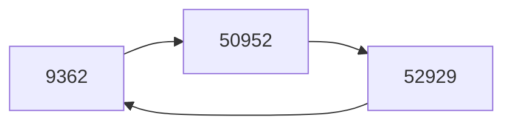

# chord_simulation
使用Python在本地模拟[chord (peer-to-peer)](https://en.wikipedia.org/wiki/Chord_(peer-to-peer))算法。

## Prerequisites

需求Python Version>= 3.7，可以通过`requirements.txt`安装所需依赖。

```sh
pip install -r requirements.txt
```

主要需要安装如下第三方库：

-   [Thriftpy/thriftpy2](https://github.com/Thriftpy/thriftpy2)：Thrift的Python实现，用于RPC通信
-   [Delgan/loguru](https://github.com/Delgan/loguru)：开箱即用的Python日志管理框架

## Project Structure

本项目组织结构如下：

-   chord_simulation:
    -   chord:
        -   `chord_base.py`: 提供thrift文件中接口`ChordNode`的基本实现以及一些工具函数
        -   `struct_class.py`: 提供thrifty文件中数据结构的基本实现
    -   idl:
        -   `chord.thrift`: thriftpy2所需的接口定义文件，定义了RPC所需的接口和数据结构等
    -   implement:
        -   `chord_basic_query.py`: 实现`ChordNode`接口，完成其中的相关方法以达到Basic Query的效果
        -   `chord_finger_table.py`: 实现`ChordNode`接口，完成其中的相关方法以达到Finger Table的效果
-   `server.py`: 服务结点ChordNode的统一启动文件，根据命令行参数在对应的地址和端口上启动对应类型的ChordNode进程
-   `client.py`: 客户端Client的实现，提供对Chord环的统一操作入口
-   `simulation.py`: 在本地模拟Chord算法，提供Chord环构建，测试数据导入以及与客户端的交互相关操作

### chord.thrift

`chord.thrift`中定义了RPC所需的接口和数据结构。

接口定义如下，其中定义了每个ChordNode进程服务向其他进程暴露的方法：

```idl
service ChordNode {
    KeyValueResult lookup(1: string key), // 查询key对应的value，返回KeyValueResult
    Node find_successor(1: i32 key_id), // 查询key/id在chord环上对应的后继是哪一个
    KeyValueResult put(1: string key, 2: string value), // 向本ChordNode执行put操作
    void join(1: Node node), // 将本ChordNode加入node结点所在的chord环
    void notify(1: Node node), // 提示本ChordNode修改前驱为node
    Node get_predecessor(), // 返回本ChordNode的前驱
    Node get_successor(), // 返回本ChordNode的后继
    string heart_beat(), // 返回本ChordNode的心跳信息
}
```

定义的数据结构包括KVStatus，KeyValueResult以及Node，每个数据结构中包含对应的属性定义：

```idl
enum KVStatus {
    VALID, NOT_FOUND // 表示K-V Pair的状态，包括有效VALID以及未找到NOT_FOUND
}

struct KeyValueResult {
    1: string key,
    2: string value,
    3: i32 node_id, // 表示该K-V Pair实际存储在哪个node结点上
    4: KVStatus status, // 表示该K-V Pair的状态
}

struct Node {
    1: i32 node_id, // 该ChordNode结点对应的node_id，计算方式为hash_func(address+port)
    2: string address,
    3: i32 port,
    4: bool valid, // 该ChordNode结点是否有效，如果valid=False，则对应结点为null
}
```

### chord_base.py

提供ChordNode的基础实现类`BaseChordNode`，后续的相关具体实现都应该直接或者间接继承该类，然后按需实现其中的方法。大部分接口方法都需要实现，详细可以参考代码。

除了在thrift文件中定义的向外暴露的接口，该类中还定义了其他可能会使用到的函数。提供的函数列表如下：

-   `lookup(self, key: str) -> KeyValueResult`: 对应thrift文件中的lookup
-   `_lookup_local(self, key: str) -> KeyValueResult`: 在本地KV存储中寻找对应的K-V Pair
-   `find_successor(self, key_id: int) -> Node`: 对应thrift文件中的find_successor
-   `_closet_preceding_node(self, key_id: int) -> Node`: 返回在find_successor过程中下一步应该寻找的结点
-   `put(self, key: str, value: str) -> KeyValueResult`: 对应thrift文件中的put
-   `join(self, node: Node)`: 对应thrift文件中的join
-   `_stabilize(self)`: 定期执行的第二个操作，定期确定自身的后继并提示后继的前驱
-   `notify(self, node: Node)`: 对应thrift文件中的notify
-   `_fix_fingers(self)`: 定期执行的第三个操作，修复自身的finger table
-   `_check_predecessor(self)`: 定期执行的第四个操作，检查前驱是否正常工作
-   `get_predecessor(self) -> Node`: 对应thrift文件中的get_predecessor
-   `get_successor(self) -> Node`: 对应thrift文件中的get_successor
-   `heart_beat(self) -> str`: 对应thrift文件中的heart_beat
-   `_fault_detect(self)`: 利用heart beat心跳信息来检测是否有结点失效
-   `_fault_recovery(self)`: 在相关结点失效之后进行剩余结点局部修复
-   `_fault_detect_recovery(self)`: 定期执行的第一个操作，用于检测结点失效并进行chord环的修复
-   `_log_self(self)`: 定期执行的第五个操作，执行日志输出，用于调试和日志记录
-   `run_periodically(self)`: 用于定期执行上面提到的相关操作，该定期执行的逻辑已实现

在BaseChordNode中还提供了logger成员变量，用于日志记录。

此外，在`chord_base.py`中还提供了相关工具函数：

-   `hash_func(intput_str) -> int`: chord算法中对应的hash函数实现
-   `connect_address(address, port)`: 连接给定地址和端口对应的服务对象
-   `connect_node(node: Node)`: 连接给定Node对应的服务对象
-   `is_between(node: Node, node1: Node, node2: Node)`: 用于chord环上的范围判断，判断node是否在node1->node2这段顺时针弧上，包括node2但是不包括node1，即在逻辑上判断node是否属于(node1, node2]
-   `is_alive_node(node: Node, node_logger)`: 用于判断某个Node是否还在线，通过Node的heart beat信息来进行判断

>   这里需要注意的是，只有在通过相关工具函数获得了对应地址和端口的服务对象之后，才能调用暴露出来的相关方法。

### struct_class.py

`struct_class.py`中定义了thrift文件中提到的数据结构，相关成员属性如上所述。

此外，其中还定义了变量`M`，这表示整个chord环的取值范围是$[0, 2^M-1]$。

### implement

implement目录下存放了ChordNode相关的真实实现，主要包括：

-   `chord_basic_query.py`: 实现Basic Query效果
-   `chord_finger_table.py`: 实现Finger Table效果

### server.py

`server.py`提供了ChordNode的统一启动入口，通过提供不同的命令行参数，可以启动对应的ChordNode服务。命令行参数包括：

-   `-t, --task_type`: 需要启动的server服务对应的实现，根据内容basic_query或者finger_table，调用对应的实现
-   `-a, --address`: server服务启动对应的地址，默认为localhost在本地启动
-   `-p, --port`: server服务对应的端口

### client.py

`client.py`提供了客户端层的实现，客户端连接chord环中的某个结点，作为操作入口。另一方面，客户端向外暴露put和get方法：

-   get方法返回内容包括: get状态，对应的KV Pair，KV Pair实际存储结点
-   put方法返回内容包括: put状态，该KV Pair实际被存储的结点

### simulation.py

`simulation.py`提供了本地chord simulation的入口，根据命令行参数的不同，执行对应的模拟（basic query或者finger table）。在每次模拟中，会先执行chord环的构建，然后导入测试数据，最后通过命令行交互的模式来执行put/get操作。

## Run Simulation

Chord的模拟运行主要分为两步，第一步是通过Python在本地启动不同的server进程，第二步是通过`simulation.py`程序来模拟Chord环的构建，测试数据的导入以及提供客户端的相关交互操作。下面是运行示例，演示了Basic Query的模拟效果：

https://github.com/EverNorif/chord_simulation/assets/79133788/e014906e-cae7-491a-93eb-5d04f643eec3

首先，通过Python启动不同的ChordNode进程，这里在本地启动了3个进程，并分别运行在50001，50002和50003端口上。

每个ChordNode都会定期执行相关函数，其中包括日志信息的打印，日志信息的其中一个格式为`{predecessor}-{self}-{successor}`。可以看到，在启动进程之后，各个ChordNode之间并不知道彼此的存在，因此它们的前驱和后继实际上都是自己。在打印日志中也可以看到，分别是`9362-9362-9362, 50952-50952-50952, 52929-52929-52929`。

之后，在另一个Terminal窗口中启动simulation。该程序首先会执行chord环的构建，让前面三个进程之间产生联系。可以看到，chord环的构建完成之后，三个进程的日志信息变成了`52929-9362-50952, 9362-50952-52929, 50952-52929-9362`，三个ChordNode构成了如下的chord环。



在完成了chord环的构建之后，simulation执行初始测试数据的导入，即导入测试KV Pair, 格式为test-key-i: test-value-i。在导入的过程中，也可以看到不同的ChordNode会定期在日志中打印自己维护的Key-Value信息。

等待测试数据导入之后，就可以在命令行中执行get/put操作了。在运行示例中，首先get一个不存在的key，返回结果not found；之后，分别get三个不同的test-key-i，这三个key存在不同的ChordNode上，返回结果也能够印证这一点；最后，执行了一个put和get操作，也能够得到正确的返回结果。

## Replication and Fault Recovery